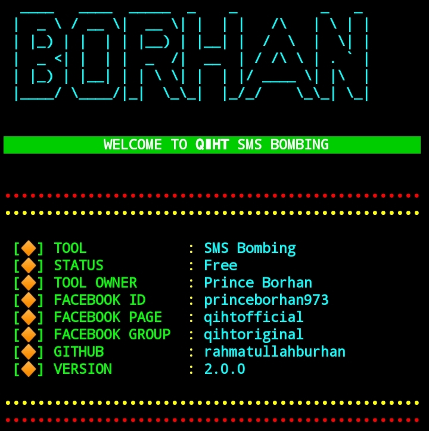
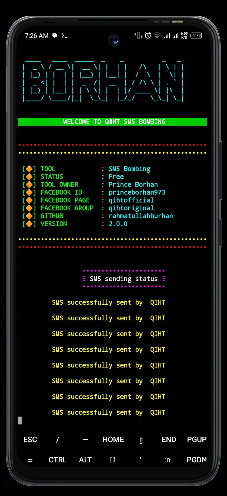

<center><h2> 𝗤𝗮𝘄𝗺𝗶𝗮𝗻 𝗜𝘀𝗹𝗮𝗺𝗶𝗰 𝗛𝗮𝗰𝗸𝗲𝗿𝘀 𝗧𝗲𝗮𝗺 - 𝗤𝗜𝗛𝗧 </h2></center>

<center></img></center></br>


<h2>INSTALLATION ⬇️</h2>


```
apt update -y

apt upgrade -y

pkg install git -y

pkg install python -y

pip install requests

git clone https://github.com/rahmatullahburhan/QIHT

cd QIHT

python QIHT.py

```


<h3>SINGLE COMMAND</h3>

```
apt update -y;apt upgrade -y;pkg install git -y;pkg install python -y;pip install requests;git clone https://github.com/rahmatullahburhan/QIHT;cd QIHT;python QIHT.py

```
<h3>DEMO SS</h3>
<center></img></center></br>

<h3><a href=https://facebook.com/QIHTOfficial/"> 𝗤𝗮𝘄𝗺𝗶𝗮𝗻 𝗜𝘀𝗹𝗮𝗺𝗶𝗰 𝗛𝗮𝗰𝗸𝗲𝗿𝘀 𝗧𝗲𝗮𝗺 - 𝗤𝗜𝗛𝗧</a></h3>
